# SplitEase — Application Workflow

This document visualizes the main user journeys and system interactions in SplitEase. Arrows show the direction of control or data flow. The current web client uses the shared Express API; the planned mobile client adds offline caching, push notifications, deep links, and device registration.

## 1. Application Entry and Authentication

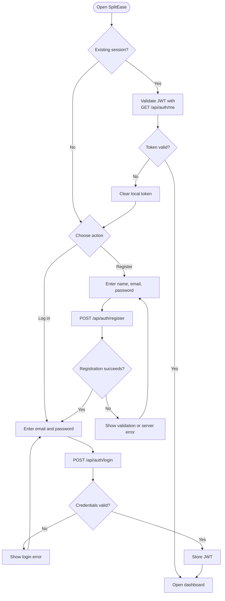

## 2. Protected Navigation

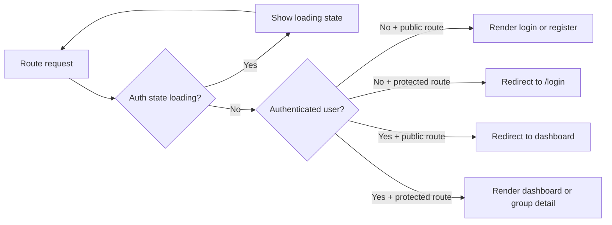

## 3. Group Creation and Membership

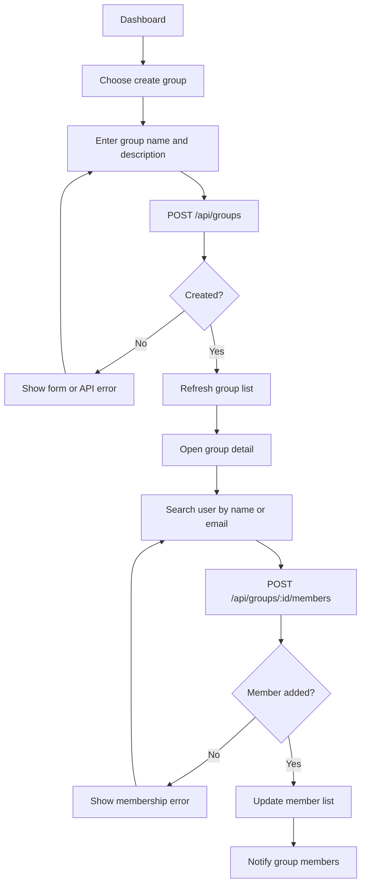

## 4. Add an Expense

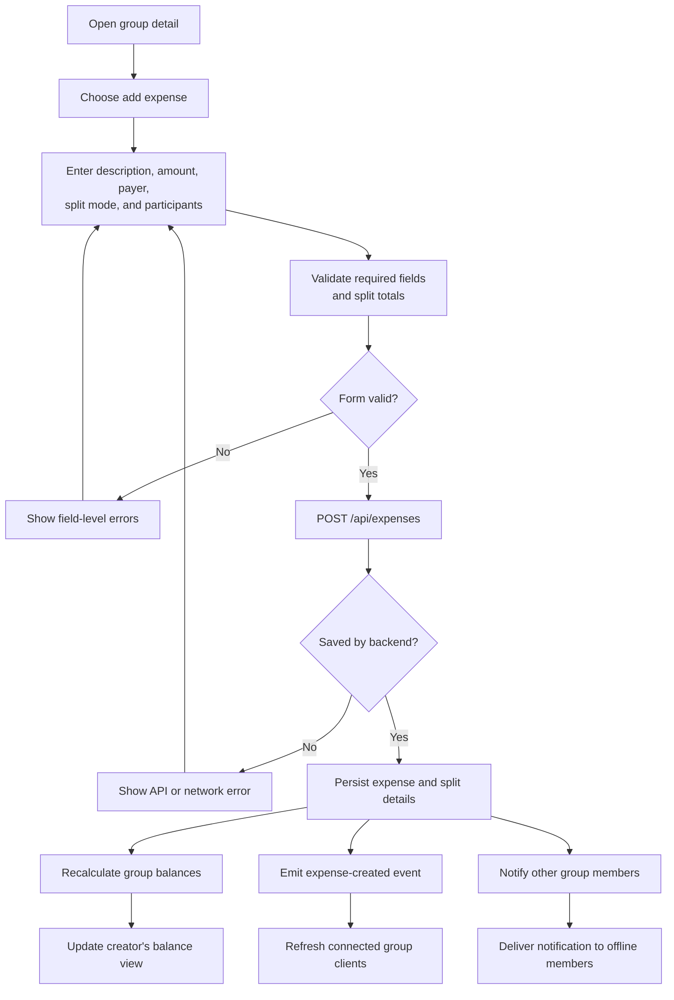

## 5. Balance Calculation and Debt Simplification

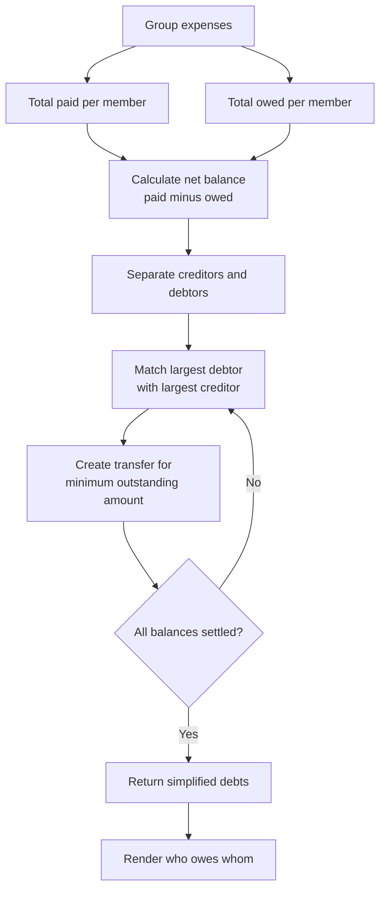

## 6. Settle a Debt

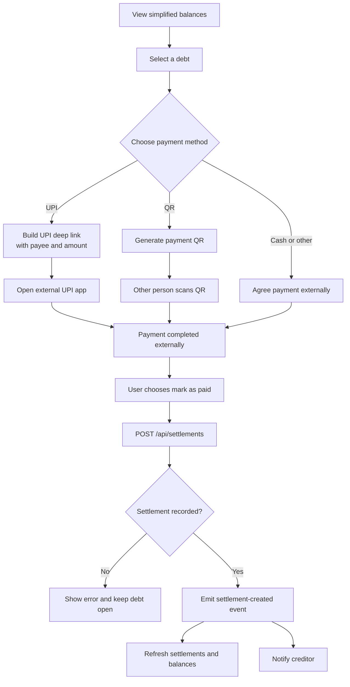

## 7. Real-Time Group Updates

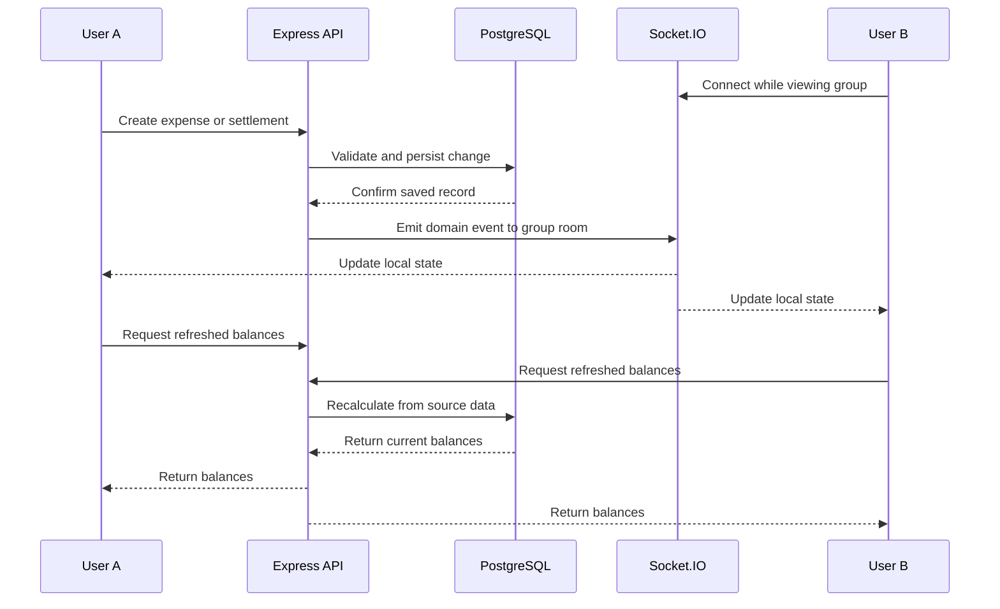

## 8. Offline and Sync Workflow

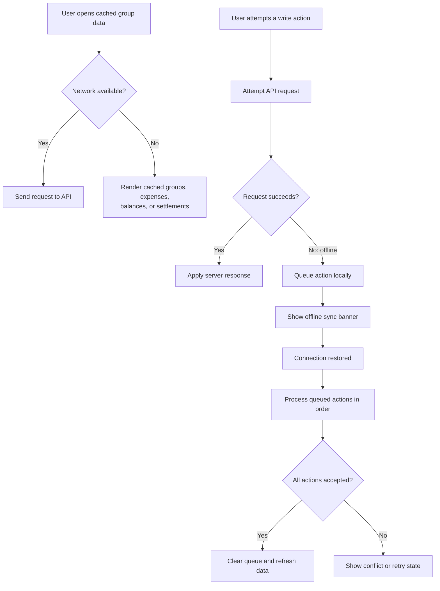

## 9. Push Notification Lifecycle

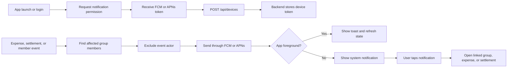

## 10. Error and Recovery Paths

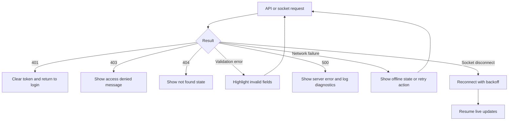

## 11. Deployment and Runtime Topology

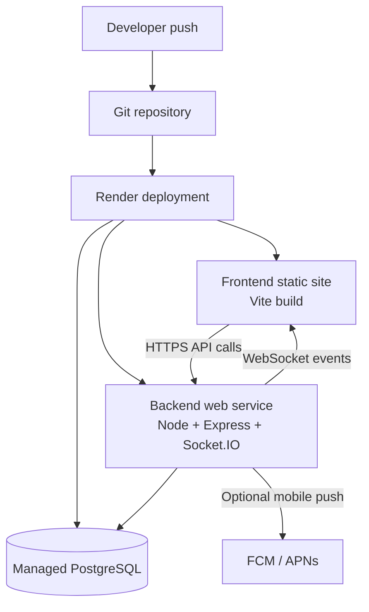

## 12. Workflow Summary

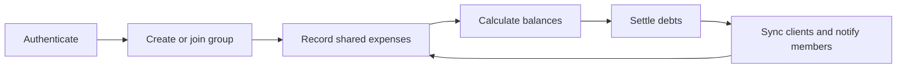